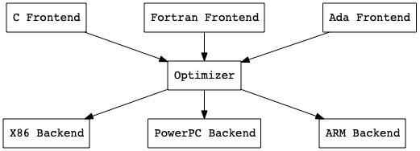

# Welcome to llir/llvm

## Overview

#### Why LLVM?

When creating a compiler, a classical design may look like this:

This worked quite well in the old days. There was only one input language, and one target machine.

Today there exist a lot of target machines to support! And a lot of input languages. Without a shared representation many parts of the compiler would have to be reimplemented for every input/output pair.

LLVM offers a solution to this problem by defining such a shared representation, namely LLVM IR. Here is the new design:

To write a compiler for a new language, now we only have to focus on our frontend. Similarly, to add support for a new target machine, now we only have to add a new backend. And to improve the code generation of all input/output pairs, now we only have to focus on the middle end optimizer. Thank you, Chris Lattner and all those who have contributed to LLVM.

#### Why llir/llvm?

The aim of [llir/llvm](https://github.com/llir/llvm) is to provide a library for interacting with LLVM IR in pure Go. Importantly, `llir/llvm` is not a binding for LLVM. Therefore, you don't have to compile LLVM (which could take a few hours), and no need to fight with Cgo.
Work under a pure Go environment and start your journey.

## Installation

To install [llir/llvm](https://github.com/llir/llvm), all you need to do is: `go get github.com/llir/llvm`.

## Usage

According to packages, [llir/llvm](https://github.com/llir/llvm) can be separated into two main parts:

1. [asm](https://pkg.go.dev/github.com/llir/llvm/asm?tab=doc): This package implements a parser for LLVM IR assembly files. Users can use it for analyzing LLVM IR files.
2. [ir](https://pkg.go.dev/github.com/llir/llvm/ir?tab=doc): This package declares the types used to represent LLVM IR modules. Users can use it for build LLVM IR modules and operating on them.
